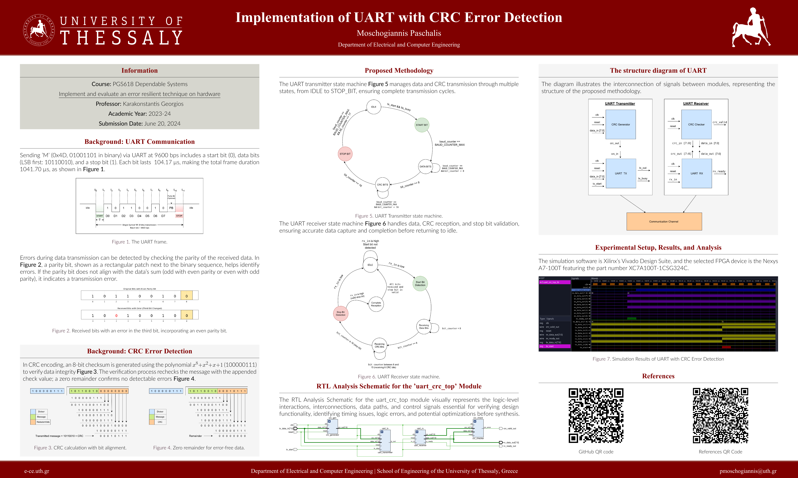

# UART with CRC Error Detection on FPGA

This repository contains the code and materials for the "Implement and evaluate an error-resilient technique on hardware (RTL/Synthesis)" project, part of the course "ΜΔΕ618 Αξιόπιστα Συστήματα" (PGS618 Dependable Systems), as part of the curriculum of the Department of Electrical and Computer Engineering, School of Engineering, University of Thessaly.

## Introduction

  <b>Click on the image to open the PDF.</b>

UART (Universal Asynchronous Receiver/Transmitter) is a hardware communication protocol that allows asynchronous serial communication between devices. CRC (Cyclic Redundancy Check) is an error-detecting code commonly used to detect accidental changes to raw data. By combining UART with CRC, we can ensure that the data transmitted is received correctly, thus enhancing the reliability of communication.

This project includes two implementations of CRC:
- **CRC-8**: A simpler and faster error detection method suitable for applications with less critical data integrity needs.
- **CRC-16**: A more robust error detection method suitable for applications requiring higher reliability and error detection capability.

## File Structure

### CRC-8 Implementation

- **uart_crc_top_crc.v**: Top-level module integrating the UART and CRC-8 components.
- **uart_transmitter_crc.v**: UART transmitter module with CRC-8 integration.
- **uart_receiver_crc.v**: UART receiver module with CRC-8 extraction.
- **crc_generator_crc.v**: CRC generator module using the CRC-8 polynomial (0x07).
- **crc_checker_crc.v**: CRC checker module that validates the received CRC-8.
- **uart_crc_top_tb_crc.v**: Testbench for the top-level module with CRC-8.
- `debug/`: Folder for debugging individual modules.
  - `uart_transmitter/`: Folder for UART transmitter module debugging.
    - `uart_transmitter.v`: UART transmitter module file.
    - `uart_transmitter_tb.v`: Testbench for UART transmitter module.

### CRC-16 Implementation

- **uart_crc_top_crc.v**: Top-level module integrating the UART and CRC-16 components.
- **uart_transmitter_crc.v**: UART transmitter module with CRC-16 integration.
- **uart_receiver_crc.v**: UART receiver module with CRC-16 extraction.
- **crc_generator_crc.v**: CRC generator module using the CRC-16 polynomial (0x1021).
- **crc_checker_crc.v**: CRC checker module that validates the received CRC-16.
- **uart_crc_top_tb_crc.v**: Testbench for the top-level module with CRC-16.

## Hardware Setup

1. **Nexys A7 FPGA Board**: Connect it to your computer via USB.
2. **UART-to-USB Adapter (optional)**: For easier UART communication with a PC.
3. **Computer**: To write, synthesize, and upload the Verilog code using Xilinx Vivado.
4. **Connection Cables**: For connecting the FPGA board to the UART adapter (if used).

## Steps to Implement and Evaluate

1. **Write the Verilog Code**: Copy the provided Verilog files into your project directory.
2. **Open Xilinx Vivado**: Create a new project and add the Verilog files.
3. **Synthesize and Implement**: Run synthesis and implementation in Vivado.
4. **Generate Bitstream**: Generate the bitstream file for your FPGA.
5. **Program FPGA**: Use Vivado to program the Nexys A7 FPGA with the generated bitstream.
6. **Test the Design**: Observe the UART transmission and reception. Verify that the CRC detects errors correctly.

## Testing

Each implementation has a corresponding testbench:
- **CRC-8 Testbench (`uart_crc_top_tb_crc.v`)**: Tests the UART communication and CRC-8 error detection.
- **CRC-16 Testbench (`uart_crc_top_tb_crc.v`)**: Tests the UART communication and CRC-16 error detection.

Run the simulation in Vivado to ensure the data is transmitted and received correctly, and the CRC is validated.

## Authors

- 

### Notes

- Ensure the correct baud rate is set for your system clock.
- Modify the testbenches to include various test cases, including erroneous data for robust testing.

## License

This project is licensed under the [MIT License](LICENSE).

- 
